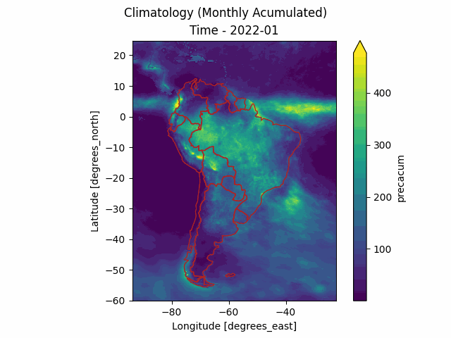

# MERGE Downloader
The `merge-downloader` package is an unofficial Python library to download MERGE products from the Brazilian National Institute for Space Research (INPE). These products include daily precipitation raster files calibrated for South America and obtained from the MERGE model (Rozante et al. 2010), as well as other climatology data.

These products include daily precipitation raster files calibrated for South America and obtained from the MERGE model (Rozante et al. 2010). The MERGE model is built upon the IMERGE/GPM model and calibrated using thousands of in-situ rain gauges to deliver bias-free results. 
Besides the daily raster precipitation from MERGE, INPE provides also other climatology data such as Year Accumulated, Monthly Average, Daily Average and others according to the following table: 

# Install

Doing: 
* Separate downloader from reporter
* Chuva anual - 1o Out/30 Sep - Últimos 10 anos

TODO List: 
* Add more info in the tabular side of the report -> ok
* Make the report with the anomalies
* Refactor the code
* Rewrite the tests
* Write console activation
* Automate report generation for several basins at once
* Add reference layer -> ok

* Depois: Acumular os valores numéricos dos períodos seco e chuvoso 
* 2 anos de gráfico
* Bacias incrementais
* Incrementais - Reservatórios - Quinzenal???
* Retirar a média de chuva no diário 
* Diário manter os últimos 30 dias
* Furnas ou Serra da Mesa: identificar construções no reservatório 
